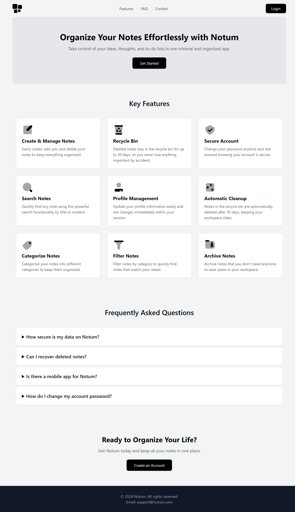
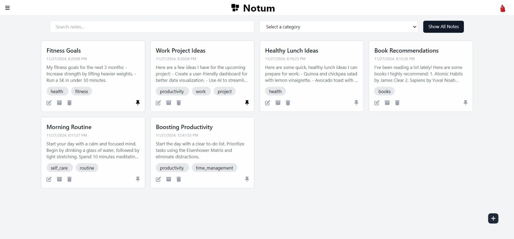

# Notum

Notum is a web application built using Node.js and Express, designed to help users manage their notes and to-do lists efficiently. The application allows users to register, log in, create notes, categorize them, manage to-do tasks, and maintain an organized archive and recycle bin for deleted items.

## Features

- User registration and authentication
- Create, edit, and delete notes
- Categorize notes for better organization
- Manage to-do lists with options to add, update, and delete tasks
- Archive notes for later reference
- Recycle bin for deleted notes with options to restore or permanently delete
- User profile management, including password change and account deletion

## Technologies Used

- Node.js
- Express.js
- EJS (Embedded JavaScript) for templating
- Tailwind CSS for styling
- MySQL for database management
- bcryptjs for password hashing
- express-session for session management
- body-parser for parsing incoming request bodies

## Installation

1. Install required softwares:

   - Node.js (Download from [nodejs.org](https://nodejs.org/) and install it).
   - MySQL (Download from [mysql.com](https://www.mysql.com/) and install it).
   - git (Download from [git-scm.com](https://git-scm.com/) and install it).

2. Open your terminal and clone the repository:

   ```bash
   git clone https://github.com/RaisulKayesRaka/Notum.git
   ```

3. Navigate to the project directory:

   ```bash
   cd notum
   ```

4. Install the required dependencies:

   ```bash
   npm install
   ```

5. Set up your MySQL database by running the SQL query provided in the `notum.sql` file. This will create the necessary tables for the application to function.

6. Create a `.env` file in the root directory (where `package.json` is located) with the following environment variables:

   ```bash
   DB_HOST=localhost
   DB_USER=root
   DB_PASSWORD=yourpassword
   DB_NAME=notum
   ```

   Ensure you replace `yourpassword` with your actual MySQL password. If you 're using a different database host, user, or name, update the corresponding variables accordingly.

7. Start the application:

   ```bash
   npm start
   ```

8. Open your web browser and navigate to `http://localhost:3000` to access the application.

## Contributing

Contributions are welcome! If you'd like to contribute to Notum, please fork the repository and submit a pull request.

## Screenshots







